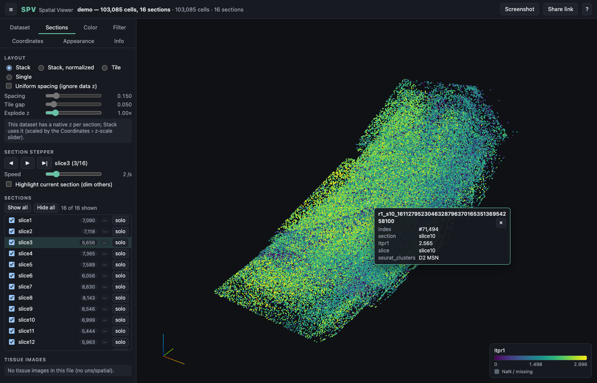

# SPV — Spatial Viewer

SPV shows spatial transcriptomics data as an interactive 3D point cloud in the browser. It opens
one AnnData `.h5ad` file at a time, from a URL or from your disk, and draws every cell or spot
coloured by metadata or by gene expression. Multi-section datasets (Visium, Xenium, CosMx, serial
MERFISH slices) become a stack you can orbit, step through, tile, or view on the tissue image. The
site is plain static files: no server, no upload, no conversion step.



## Use it

Open the site (`https://<user>.github.io/<repo>/` once [deployed](#deploy)), then pick a dataset
from the list, paste the URL of a CORS-enabled `.h5ad`, or drop a file from your disk onto the
page. Files never leave your browser.

Links carry the whole view: `#dataset=<id>` opens a hosted dataset, `#url=<encoded-url>` any file
on the web, and the **Share link** button adds layout, colours, filters and camera.

## What you can do

- **Layouts.** Stack sections along z (real z or uniform spacing), recentre each section, tile them side by side, or step through them one at a time with play/pause. Show, hide or solo any section; adjust spacing, z-scale and explode.
- **Colour.** By any categorical or numeric `obs` column, or by a gene from `X`, a layer or `raw.X`, with log1p, colormaps, percentile or explicit ranges, a histogram with draggable handles, and two-gene blends. Click a legend entry to hide it, shift-click to solo it.
- **Tissue images.** Per-section overlays placed like `squidpy.pl.spatial_scatter`, with opacity, resolution and grayscale controls.
- **Inspect.** Hover for a tooltip, click to pin it. Lasso or box-select cells and export them as CSV or TSV. Overlay the spatial neighbour graph. Pick genes from `uns/moranI`.
- **Filter.** `in_tissue`, X/Y clip planes, z range, random subsampling.
- **Align.** Nudge, rotate or flip a section, or type the z it should be drawn at. Corrections travel in the share link or the dataset manifest.
- **Export.** PNG screenshots at 1× or 2×, optionally transparent; a light theme on pure white for figures.

## Files it reads

AnnData 0.8 and later plus legacy files; `X`, layers and `raw.X` as dense, CSR or CSC; numeric,
string, boolean, categorical and nullable `obs` columns; coordinates from `obsm/spatial3d`,
`obsm/spatial`, `X_spatial` and similar keys, with z from `obs` when present; sections from a
`library_key` column, common column names, or a discrete z; images as uint8, uint16 or float; gzip
and shuffle built in, other filters (lzf, zstd, blosc, lz4, bz2, …) loaded on demand. Any
coordinate or section choice can be overridden in the Coordinates panel.

Limits worth knowing: files hosted on GitHub Pages must stay under 100 MB; a CSR matrix needs one
pass over its index before the first gene appears (convert large files to CSC); alignment is
manual; WebGL 2 is required.

## Deploy

1. Fork or clone this repository and push it to GitHub.
2. In the repository settings, open **Pages** and set **Source** to **GitHub Actions**.
3. Push to `main`. The workflow checks, builds and deploys the site.
4. Open `https://<user>.github.io/<repo>/`.

To add datasets, shrink large files, host them elsewhere, or run on your own server, see
[docs/hosting.md](docs/hosting.md).

## Develop

```sh
npm ci
npm run dev      # http://localhost:5173/ with data/ served with range requests
npm run check    # typecheck, lint, unit tests
npm run e2e      # Playwright against a production build
npm run build && npm run preview
```

Pull requests run the same checks in CI. How the viewer works, what was measured, and how to
diagnose drawing problems: [docs/internals.md](docs/internals.md). Decisions and history:
[PLAN.md](PLAN.md), [CHANGELOG.md](CHANGELOG.md).

## Keyboard shortcuts

| Key | Action |
|---|---|
| `R` | Reset view |
| `H` | Toggle sidebar |
| `F` | Fullscreen |
| `S` | Screenshot |
| `1` / `2` / `3` / `4` | Top / front / side / isometric view |
| `←` / `→` | Previous / next section |
| `Space` | Play / pause |
| `I` | Toggle tissue images |
| `L` | Cycle layout |
| `O` | Toggle orthographic camera |
| `X` | Selection mode (Shift-drag for a box) |
| `D` | Copy a diagnostic report |
| `Esc` | Clear the pin or selection, leave selection mode |
| `?` | Help |

## Privacy

Everything runs in your browser. Local files are read in place and never uploaded; remote files
are fetched by your browser directly from the host you name. The page loads nothing from third
parties. [SECURITY.md](SECURITY.md) describes the threat model and how to report a problem.

## License

MIT, see [LICENSE](LICENSE).
