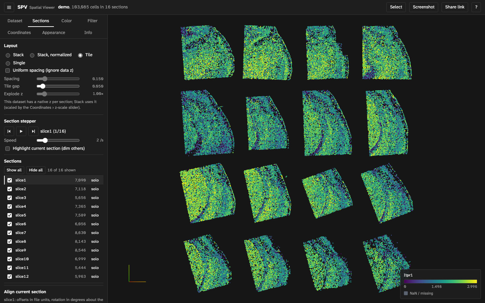

# How SPV works

Architecture notes, measurements and diagnostics for developers. Decisions and their history are in [PLAN.md](../PLAN.md); the original brief is [SPEC.md](../SPEC.md).

## The demo dataset

`data/demo.h5ad` (24 MB) is a 16-slice mouse brain dataset with 103,085 cells and 434 genes. It is a
native 3-D file: `obsm/spatial` has three columns and each `obs/slice` category sits on one z level
(320–618, non-uniform spacing), `X` is CSR float64 with log-normalised values, and `uns` is empty
(no tissue images, no stored colours). SPV therefore stacks the slices at their real z, offers
"Uniform spacing" to space them evenly instead, generates palettes for the five categorical columns,
and builds the CSR column index on the first gene. Slices are drawn at exactly the z stored in the
file (spacing varies: 20, 15, 25, 18, 20, …). If a slice is known to be stored at the wrong z, type its
correct z in Sections › Align current section › "Shown at z"; the offset is kept in the share link and can
be made the default for a hosted dataset through the manifest's `section_alignment`. Everything about
the file that needed a special case is listed in [`PLAN.md`](../PLAN.md).

## Design notes

- **Worker-only I/O.** `h5wasm` lives in one Web Worker with a small typed RPC (`open`, `getSummary`, `getSpatial`, `getObsColumn`, `getVarNames`, `getGeneVector`, `getImage`, `getGraphEdges`, …). Typed arrays are transferred, never copied. Requests run in order; long scans yield between chunks so progress and cancellation work. The HDF5 "throwing error handler" is always on because failed reads otherwise return garbage silently.
- **Partial reads.** Open reads only structure, shapes, attributes, coordinates, var names and the obs column list. Columns, genes, images and graphs are read on demand. `uns` is never read wholesale.
- **Remote files.** A HEAD plus a ranged GET of the first 8 bytes verifies the HDF5 signature and byte-range support before Emscripten's lazy file is created (its own failure path would abort the WASM runtime). Local files are mounted with `WORKERFS`, so nothing is copied into WASM memory.
- **Texture-driven rendering.** One `THREE.Points`. Per-point attributes are uploaded once per dataset (positions, section ordinal, validity) and once per colour variable (scalar or code). Everything interactive is a small texture or uniform: a 256-texel colormap, a palette whose alpha channel is the category mask, and a per-section transform table (offset, alpha, rotation/flip, pivot) that implements all four layouts, section visibility, dimming and manual alignment. Native z is kept through a `uNativeZ` uniform, so native-3D stacks and uniform stacks share one shader path.
- **Display frame.** Flips and the Y/Z swap are applied in the shader before the section transform; the same `toDisplay` function produces the section geometry, image-plane placement and clip bounds on the CPU, so images always follow their spots.
- **Picking.** Point ids are rendered as colours into a small target around the cursor through `camera.setViewOffset` and read back asynchronously; no raycasting. A mouse picks the exact pixel (1×1); a touch tap searches a 12 px radius and takes the nearest point, and it waits for an in-flight hover pick instead of unpinning.
- **Selection.** Lasso/box selection re-runs the vertex-shader transform on the CPU (display frame, section table, alignment, explode, camera) for the visible points and tests them against the screen-space polygon, so it agrees with what is drawn; exports fetch cell ids from the worker in one pass.
- **State.** One typed slice store drives both the GPU side and the panels; the URL hash is a compact, versioned serialisation of everything except transient UI, written with `replaceState` after a debounce.
- **Visual design.** Colour belongs to the data: the chrome is neutral grey in both themes and shows state with ink weight and fill, never hue, so the point cloud, swatches, colorbars and tissue images are the only chromatic elements (warnings excepted). The light theme draws on pure white, so an exported screenshot drops straight into a figure. The typeface is Atkinson Hyperlegible Next, self-hosted from `@fontsource-variable` (no third-party requests, about 53 KB of woff2), chosen because gene symbols mix I, l and 1. Each row of the Sections list carries a tick at the section's drawn z; read down the list, the ticks form a staircase that shows the real spacing between sections, including alignment offsets and the effect of "Uniform spacing".
- **Deviations from the original spec** (ESLint flat config, TypeScript 5.9 instead of 7, embedded WASM, fixture sizes) and everything the demo file changed about the design are recorded in `PLAN.md`.

Points are drawn in batches of 65,536 (one `THREE.Points` each, sharing shaders and uniforms;
ids stay global through a per-batch offset), and graph edges in batches of 32,768 (65,536
vertices). This keeps every vertex buffer under 1 MiB, which
works around a Safari/Metal bug seen on an AMD iMac: past the first 1 MiB of a position buffer
the GPU read other rows' coordinates, so the tail of one section and every later section were
drawn in the wrong place. The `D` report's "Displaced cells" line detects this class of problem.

## Measured performance

Measured on the production build served locally, Chromium 1243 (Playwright) with ANGLE Metal on an
AMD Radeon Pro 5500 XT (a desktop discrete GPU, so frame times are better than on the spec's
integrated-graphics laptop; the numbers are frame times including GPU completion, not vsync-capped
frame rates). The synthetic files come from `scripts/make_synthetic_demo.py`.

| Measurement | Result |
|---|---|
| `data/demo.h5ad` (103,085 cells, 16 sections, 24 MB): navigation → points visible | 0.58 s, of which HDF5 engine start 30 ms, open + summary 80 ms, coordinates + section model 55 ms |
| Bytes fetched before the first frame (lazy range requests) | 7.3 MB of 25.2 MB; 21 MB after the first gene (CSR index needs all of `X`) |
| Same file with a full download instead of range requests (local server) | open 87 ms + coordinates 27 ms after the 25 MB download |
| Frame time while orbiting, 3 px points | 103k: 2.9 ms · 500k: 5.2 ms · 2M: 11.1 ms (≈ 340 / 190 / 90 fps capacity) |
| Frame time, 2M points at 6 px | 19 ms (≈ 53 fps) |
| Layout switch (stack ↔ tile ↔ single), spacing, explode, step, hide section | 2–4 ms of main-thread work at 103k–500k points, 9 ms at 2M; no position re-upload |
| Colormap, range, category toggle, point size, opacity | < 1–3 ms (texture/uniform updates) |
| Gene switch, CSR demo | first gene 0.95 s (builds the 71 MB in-memory column index in the worker), then 12–22 ms |
| Gene switch, CSC (synthetic 500k × 50 / 2M × 8) | 60–85 ms / 220–350 ms |
| GPU pick latency (hover) | 5–13 ms |
| Tissue images: 4 sections × 2048 × 2048 hires (synthetic Visium-like) | all decoded + uploaded 1.3 s after the first frame (67 MB of textures); stepping sections in Single mode 2 ms per step |
| Switching datasets 3× (demo ↔ 4-image file) | GPU geometries 2 → 2, textures 3 → 2, image bytes 0; WASM heap grows once (19 → 40 MB) and then stays flat |

Initial JS payload: 188 kB gzipped (Three.js included). The worker chunk with the HDF5 engine
(4.8 MB, WASM embedded in the JS) loads when the first dataset is opened.

## Diagnostics

If a browser draws the view wrongly, press `D` and paste the report (it is copied to the
clipboard and printed to the console). It starts with the version, build stamp and browser and
ends with the last errors the page saw. The WebGL context can be created differently from the page
URL, before the `#`: `?gl=noaa` (no antialiasing), `?gl=opaque` (no alpha channel),
`?gl=preserve` (preserveDrawingBuffer), or a comma-separated combination.

The report lists: version, build and browser; the sections the GPU drew (pixel census, offscreen and on the canvas) and where, versus the CPU projection; draw calls per frame; granted context attributes; a coordinate-buffer check; the last errors seen.
